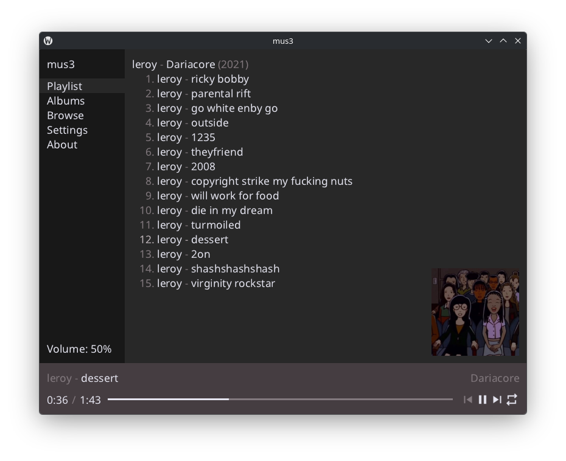
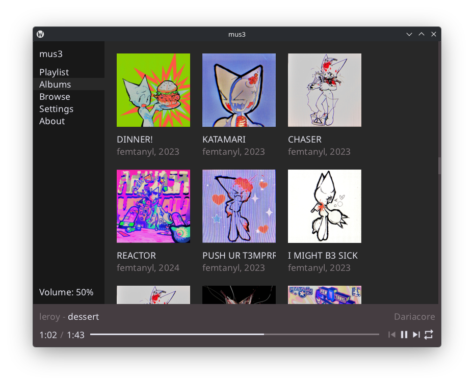
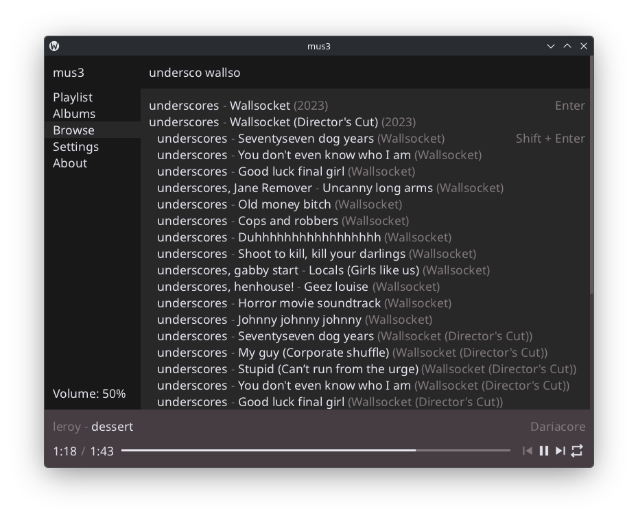

# mus3
Simple and lightweight music player supporting MP3 and FLAC formats.

## Quickstart
Download the release from [releases](https://github.com/thisisignitedoreo/mus3/releases/latest), or build from source:
```console
$ git clone https://github.com/thisisignitedoreo/mus3.git --recursive
$ cd mus3
$ make [MPRIS=1] [RELEASE=1]
```

## Gallery




## Thanks
- @raysan5 for [raylib](https://www.raylib.com/)
- @mackron for [miniaudio](https://miniaud.io/)
- [libsystemd](https://systemd.io/) for sd-bus (I am not using dbus-1 anytime soon)
- Noto Sans team (default font)